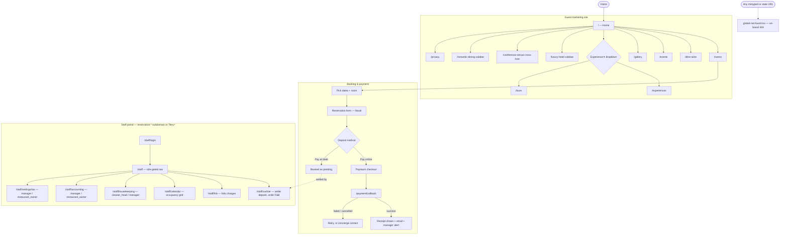

# Full-site QA guide

**Audience:** QA / manual testers doing a full pass of the site (not just one feature)
**Scope:** Guest marketing site → booking & payment → staff portal → error handling
**Last updated:** September 2026

This is the top-level walkthrough for testing the whole site end to end. For deep dives into
one area, use the specialized guides instead and come back here for the rest:

| Area | Specialized guide |
|------|--------------------|
| Front-desk / cashier payments (cash, card, transfer) | [`docs/testing/staff-payment-test-guide.md`](../testing/staff-payment-test-guide.md) |
| RBAC, room blocks, housekeeping, F&B VAT, Paystack reconciliation | [`docs/testing/staff-portal-phase-0-3-test-guide.md`](../testing/staff-portal-phase-0-3-test-guide.md) |
| Guest reservation + deposit automated coverage | [`docs/testing/reservation-qa-checklist.md`](../testing/reservation-qa-checklist.md) |
| Paystack test-card booking walkthrough | [`docs/testing/paystack-test-booking.md`](../testing/paystack-test-booking.md) |

---

## Known issue — do not re-report

Three photos are **known-broken stock placeholders** waiting on real hotel photography. The
site is built to degrade gracefully (a neutral placeholder icon, not a broken-image glyph) —
seeing the placeholder icon at these three spots is **expected**, not a bug:

| Spot | Page | Source file |
|------|------|-------------|
| Grand Ballroom | `/events` | `src/features/phase-2-product-expansion/content/event-spaces.ts` |
| Garden Pavilion | `/gallery` (Events & Meetings tab) | `src/content/gallery.ts` (`events-03`) |
| Outdoor Bar | `/gallery` (Outdoor Bar tab) | `src/content/gallery.ts` (`outdoor-01`) |

**Only file a bug if:** the page shows raw broken-image alt text or a browser broken-image
icon instead of the neutral placeholder — that would mean the fallback (`src/components/safe-image.tsx`)
itself regressed. Otherwise, treat these three as a content backlog item: someone needs to drop
in real photography and swap the `src` in the file listed above.

---

## Site map & flow diagram

Notes on the diagram:
- **Experience** is a hover/click dropdown in the header, not a page of its own — it only reveals
  Experiences and Tours.
- The three `SEO*` pages (`luxury-hotel-calabar`, `conference-venue-cross-river`,
  `romantic-dining-calabar`) are landing pages for search traffic, not linked from the main nav —
  reach them by typing the URL directly.
- Staff portal role gates (who can reach what) are the authoritative matrix in
  `src/lib/staff-roles.ts` — see the RBAC guide above for the full per-role test matrix.
- Every route not shown above (including a typo of any route above) should resolve to the
  on-brand 404, not a raw error — see [404 handling](#404--broken-link-handling) below.

---

## Before you start

| Item | Value |
|------|-------|
| Local dev server | `npm run dev` → `http://localhost:3002` |
| Guest site (local) | `http://localhost:3002/en` |
| Staff portal (local) | `http://localhost:3002/en/staff?key=relief-demo-2026` |
| Dashboard key | `DEMO_DASHBOARD_KEY` in `.env.local` (default `relief-demo-2026`) |
| Locales | `en`, `fr`, `pcm`, `ig`, `yo` — swap the `en` segment or use the header language switcher |
| Theme toggle | Moon/sun icon in the header (`button[aria-label="Toggle theme"]`) |

Treat any staff URL + key like a password — don't paste it into a public chat or ticket.

---

## 1. Guest marketing pages

For **every** page in this section, check all three:

- [ ] Loads with no console errors (open devtools → Console)
- [ ] Renders correctly in **both** light and dark mode (toggle via the header button)
- [ ] Renders correctly at desktop (1280px) **and** mobile (375px) width

| # | Page | What to specifically look for |
|---|------|-------------------------------|
| G1 | `/` Home | Hero, stats, room teaser, WhatsApp float button |
| G2 | `/rooms` | Category tabs (Guest Room / Executive / Suites / Penthouse) filter correctly |
| G3 | `/dine-wine` | Menus/venues render; "Book" CTA uses the teal `.btn-primary` style |
| G4 | `/events` | Stat bar + 3 venue cards — **Grand Ballroom card shows the known placeholder, see above** |
| G5 | `/gallery` | Category tabs; lightbox opens/closes with Escape; **Garden Pavilion / Outdoor Bar show the known placeholder** |
| G6 | `/experiences` | "Top 20 places" grid, room category cards, Calabar & Cross River cards |
| G7 | `/tours` | 4 tour cards; "Book a room & note interests" and "Talk to our Team" both present |
| G8 | `/luxury-hotel-calabar` | SEO landing page renders full page (header, hero, footer) |
| G9 | `/conference-venue-cross-river` | Same as above |
| G10 | `/romantic-dining-calabar` | Same as above |
| G11 | `/privacy` | Policy sections render; contact email is correct |

---

## 2. Booking & payment flow

Full detail and the Paystack test card live in
[`paystack-test-booking.md`](../testing/paystack-test-booking.md). Quick pass:

1. From `/rooms`, pick dates and a room → start the reservation form.
2. Fill guest details. Confirm the **deposit is ~20% of the stay total**, not the full amount.
3. Choose **pay online** → complete Paystack checkout with the test card.
4. Land on `/payment/callback`:
   - [ ] Success view shows a receipt card (amount, reference, "receipt sent to `{email}`")
   - [ ] No raw internal reservation UUID is shown to the guest
   - [ ] If it doesn't confirm within ~60s, a "Check again" + concierge-contact prompt appears
5. Try a **failed/cancelled** Paystack attempt → confirm a retry path + concierge contact, not a dead end.
6. Confirm the same reservation appears in staff **Accounting** / **Cashier** with the right
   payment channel label (`paystack`, `cash`, `moniepoint_terminal`, or `moniepoint_transfer`).

---

## 3. Staff portal

Detailed per-role and per-feature test steps live in the two specialized guides linked at the
top. Minimum smoke pass for a full-site run:

| # | Page | Check |
|---|------|-------|
| S1 | `/staff/login` | Wrong name/PIN rejected; correct one opens the portal |
| S2 | `/staff` (Dashboard) | Occupancy calendar loads; color legend matches actual cell colors |
| S3 | `/staff/cashier` | Settle deposit (Cash) marks a pending reservation confirmed |
| S4 | `/staff/fnb` | Search a booked guest → post a charge → appears on their folio |
| S5 | `/staff/calendar` | Tap a free (green) cell → walk-in booking form opens |
| S6 | `/staff/housekeeping` | Block a room for cleaning; confirm only `cleaner_head`/manager can |
| S7 | `/staff/accounting` | Ledger totals by channel (Cash/Paystack/Moniepoint) match expectations |
| S8 | `/staff/settings/tax` | VAT percentage change is saved and reflected in F&B charges |
| S9 | Role switch | Log in as each of the 4 roles (`cashier`, `manager`, `restaurant_owner`, `cleaner_head`) and confirm the nav only shows what `src/lib/staff-roles.ts` grants |

---

## 4. 404 / broken-link handling

The site's root layout is locale-scoped (`src/app/[locale]/layout.tsx`), so a URL that matches
**no route at all** is handled by `src/app/global-not-found.tsx` — a standalone page, not a normal
Next.js layout child. Test it directly, since it's easy for a regression here to slip past normal
page-by-page QA:

1. Visit a nonsense URL, e.g. `http://localhost:3002/en/this-page-does-not-exist`.
2. Confirm:
   - [ ] HTTP status is `404` (check devtools Network tab, not just the visible page)
   - [ ] Page shows the on-brand "404 / We couldn't find the page you're looking for / Return
     home" card — **not** a raw "Missing `<html>` and `<body>` tags" dev error, and not a blank
     page
   - [ ] Renders correctly in both light and dark mode (this page has no theme toggle button of
     its own — it reads the OS/stored preference on load)
   - [ ] "Return home" link goes to `/` and actually loads the homepage
3. Repeat with a nonsense URL **under** `/staff/...` (e.g. `/en/staff/does-not-exist`) — same checks.

---

## Pass / fail summary

| Section | Pass? |
|---------|-------|
| 1. Guest marketing pages (G1–G11) | ☐ |
| 2. Booking & payment flow | ☐ |
| 3. Staff portal (S1–S9) | ☐ |
| 4. 404 / broken-link handling | ☐ |

## Sign-off

| Role | Section(s) | Date |
|------|------------|------|
| QA | | |
| Product | | |

---

## Troubleshooting

| Symptom | What to try |
|---------|-------------|
| "Invalid dashboard key" on any `/staff/*` page | Match the URL's `key=` to `DEMO_DASHBOARD_KEY` in `.env.local` |
| Paystack checkout doesn't appear / stays in demo mode | Needs real `sk_test_`/`pk_test_` keys and `DEMO_MODE` not `true` |
| A page 404s that should exist | Check the actual route in `src/app/[locale]/...` — some staff nav entries point to nested paths (e.g. tax settings is `/staff/settings/tax`, not `/staff/settings`) |
| Theme toggle button not found on a page | Only pages using `SiteHeader` have it; `global-not-found.tsx` and any standalone page intentionally have no header |
