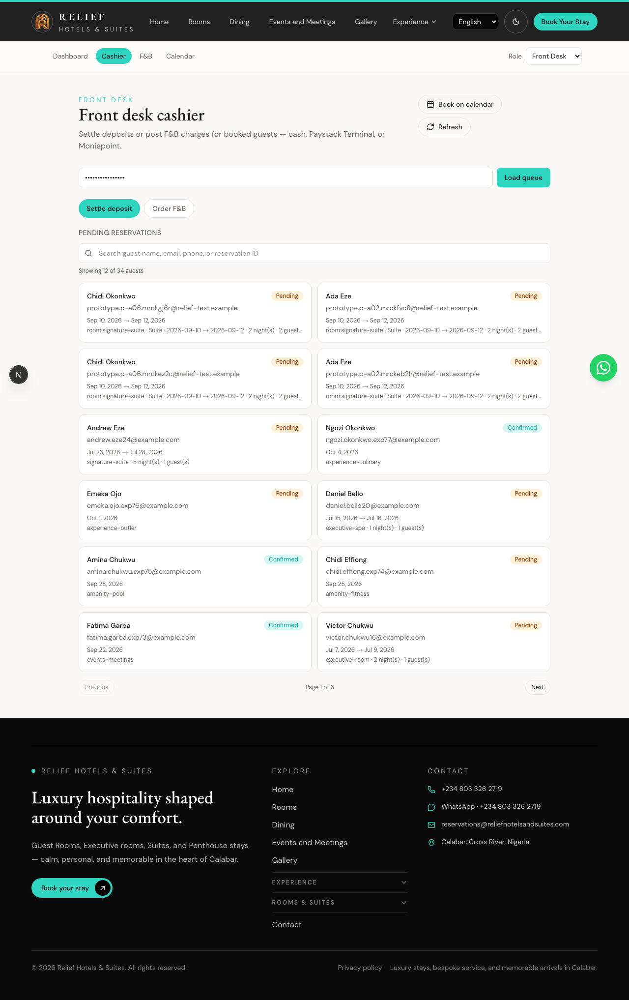
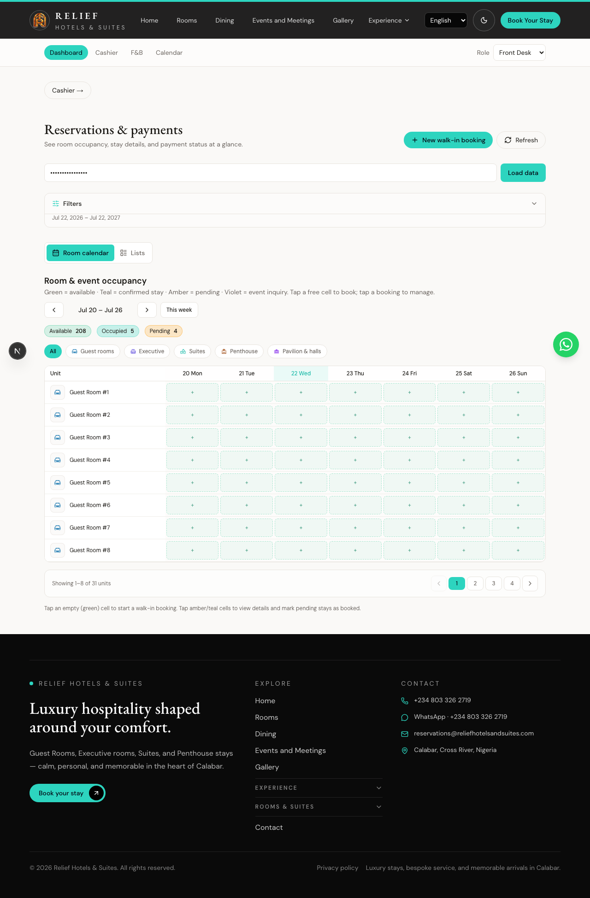
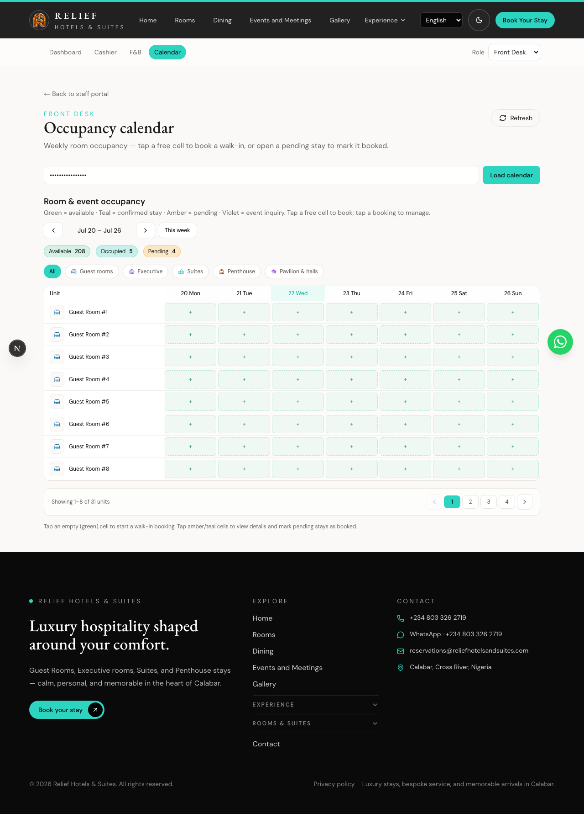
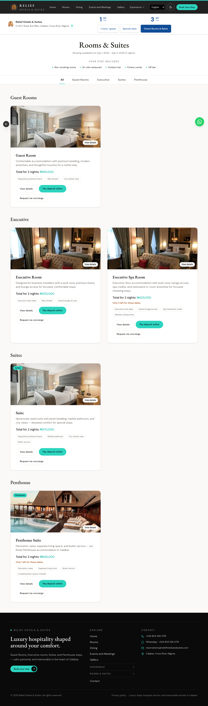
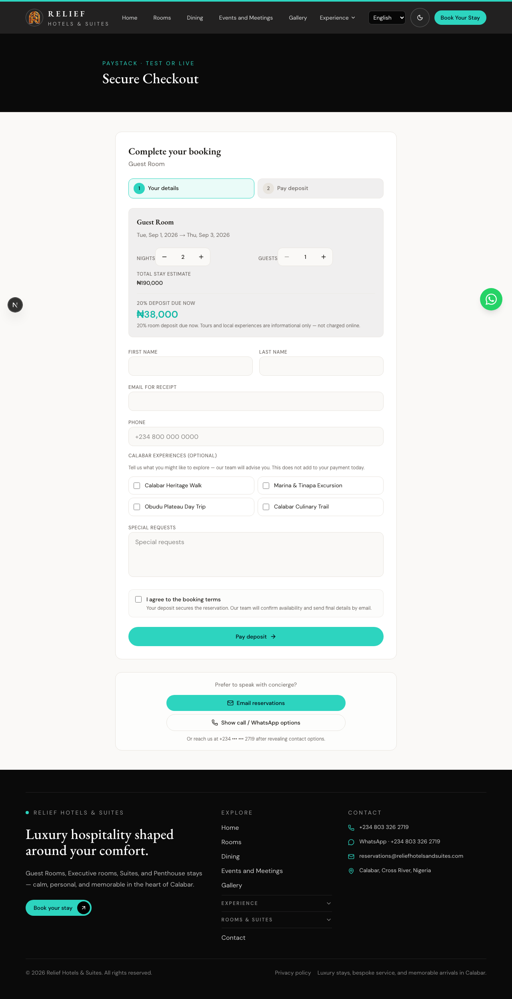
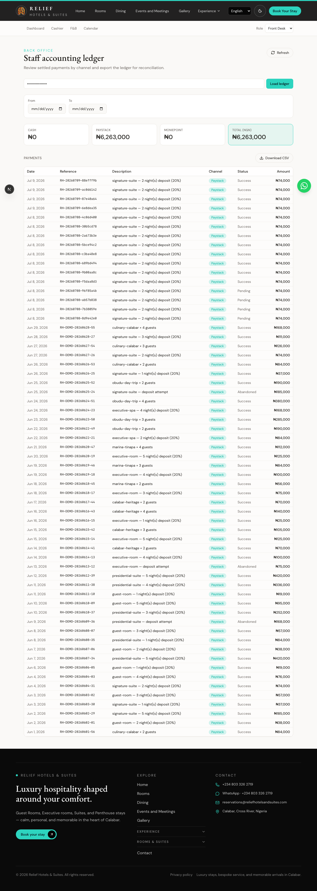
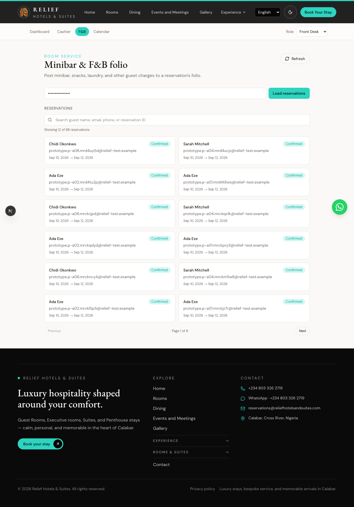

# Staff payment testing guide — Relief Hotels

**Audience:** Front desk, cashier, and ops staff  
**Purpose:** Walk through how to test guest and front-desk payments before go-live  
**Last updated:** July 2026  

Screenshots below were captured from the staff portal and guest booking flow.  
**PDF:** [staff-payment-test-guide.pdf](./staff-payment-test-guide.pdf)

---

## Before you start

| Item | Value |
|------|--------|
| Staff portal (local) | `http://localhost:3002/en/staff?key=relief-demo-2026` |
| Staff cashier | `http://localhost:3002/en/staff/cashier?key=relief-demo-2026` |
| Staff calendar | `http://localhost:3002/en/staff/calendar?key=relief-demo-2026` |
| Production staff | `https://reservation.reliefhotelsandsuites.com?key=YOUR_KEY` |
| Guest site | `https://www.reliefhotelsandsuites.com` (or local `:3002`) |
| Dashboard key | Same as `DEMO_DASHBOARD_KEY` in env (default `relief-demo-2026`) |

**Paystack Test card (online deposits):**

| Field | Value |
|-------|--------|
| Card | `4084 0840 8408 4081` |
| CVV | Any 3 digits |
| Expiry | Any future date |
| PIN | `0000` |
| OTP | `123456` |

Treat the staff URL + key like a password. Do not use **live** Paystack keys for practice.

---

## Test A — Cashier: settle a deposit (cash)

Use this when a guest booked online but has not paid, or for a walk-in you recorded as pending.

### Steps

1. Open **Cashier** with your staff key.
2. Choose **Settle deposit**.
3. Pick a guest who still needs a deposit.
4. Select **Cash** (fastest QA path without POS hardware).
5. Confirm the amount (should be ~**20% deposit**, not full stay).
6. Tap **Settle**.
7. Open **Inbox** / calendar — stay should show as **booked / confirmed**.

### Screens



*Figure 1 — Cashier entry (settle deposit / order F&B).*


*Figure 2 — Settle deposit queue / panel.*



*Figure 3 — Bookings inbox after settle (confirm status).*

---

## Test B — Calendar walk-in booking

1. Open **Calendar**.
2. Tap a **green (free)** cell for the room and check-in date.
3. Fill guest details; set **check-out** for the full stay.
4. Save (cash / no deposit / Moniepoint as available).
5. Cell should turn **teal** (booked) or **amber** (pending).
6. If pending: open the booking → **Mark as booked** after payment.



*Figure 4 — Occupancy calendar (tap free cell to book).*

---

## Test C — Guest online Paystack deposit

1. On the public site, choose dates → **Rooms**.
2. Select a room → **Pay deposit online** (or book flow).
3. Complete guest form → Paystack checkout.
4. Pay with the **test card** above.
5. You should land on **payment success / callback**.
6. In staff **Accounting** or inbox, confirm the payment row.



*Figure 5 — Guest rooms & rates (start of online path).*



*Figure 6 — Guest reservation / pay deposit form.*



*Figure 7 — Accounting ledger (payments for QA verification).*

---

## Test D — F&B charge for a booked guest

1. Open **Cashier → Order F&B** or **`/staff/fnb`**.
2. Search the booked guest (name, email, phone, or reservation ID).
3. Add catalog lines → post to folio.
4. Confirm the charge appears for that stay.



*Figure 8 — F&B / folio charges for booked guests.*

---

## Pass / fail checklist

| # | Check | Pass? |
|---|--------|-------|
| 1 | Cashier cash settle marks reservation confirmed | ☐ |
| 2 | Calendar walk-in creates a visible stay | ☐ |
| 3 | Online test card reaches success callback | ☐ |
| 4 | Payment visible in accounting / inbox | ☐ |
| 5 | F&B line posts to a booked guest | ☐ |
| 6 | Staff key rejected when wrong / missing | ☐ |

---

## Troubleshooting

| Symptom | What to try |
|---------|-------------|
| “Invalid dashboard key” | Match URL `key=` to `DEMO_DASHBOARD_KEY` |
| Paystack stays in demo / no real page | Valid `sk_test_` + `pk_test_` keys; `DEMO_MODE` must **not** be `true` |
| Terminal options missing | Needs `PAYSTACK_TERMINAL_ID` or Moniepoint env — use **Cash** for desk QA |
| Callback wrong host | Callback must be **www** `/payment/callback`, not staff subdomain |

More detail: [paystack-test-booking.md](./paystack-test-booking.md) · [STAFF.md](../deploy/STAFF.md)

---

## Regenerate screenshots / PDF

```bash
# Dev server on :3002
npm run dev

# Capture screenshots + HTML index
node scripts/capture-staff-payment-guide.mjs

# Build PDF from the guide HTML
node scripts/export-staff-payment-guide-pdf.mjs
```
